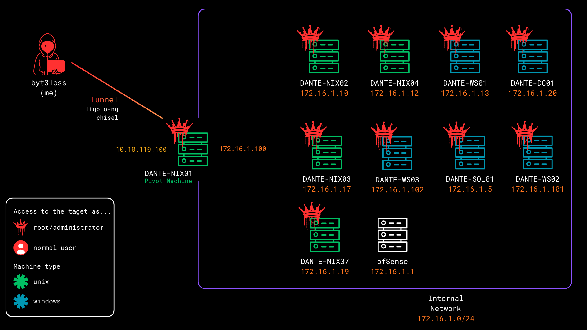
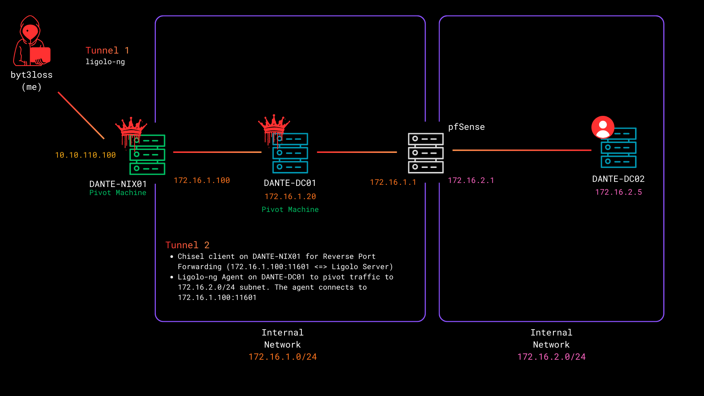

**This is not a writeup**, just progress tracking and brainstorming.

### First subnet

### Admin subnet

### Changelog

- **Date**: 2026-02-05
    - **Captured flags**: 15/27
    - **Root foothold**: 6
    - **User foothold only**: 1

- **Date**: 2026-02-06
    - **Captured flags**: 18/27
    - **Root foothold**: 7
    - **User foothold only**: 2
    - Gained access to `172.16.2.0/24` subnet.

- **Date**: 2026-02-14
    - **Captured flags**: 24/27
    - **Root foothold**: 11
    - **User foothold only**: 1
    - Rooted all the machines in `172.16.2.0/24` subnet.

- **Date**: 2026-02-19
    - **Captured flags**: 27/27
    - **Root foothold**: 13
    - **User foothold only**: 0
    - Rooted all the machines and completed the lab.
